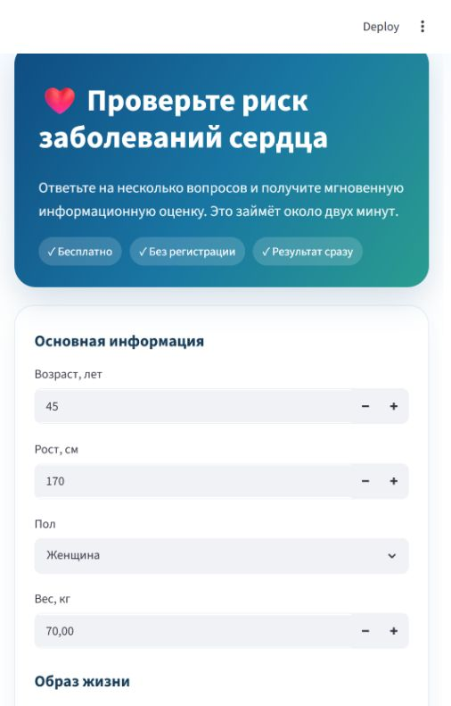
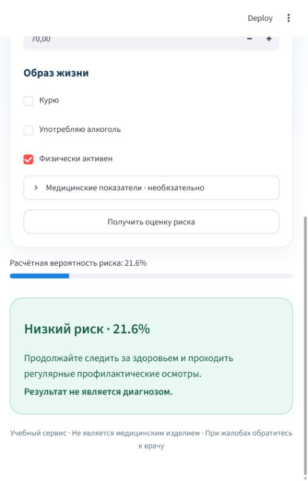
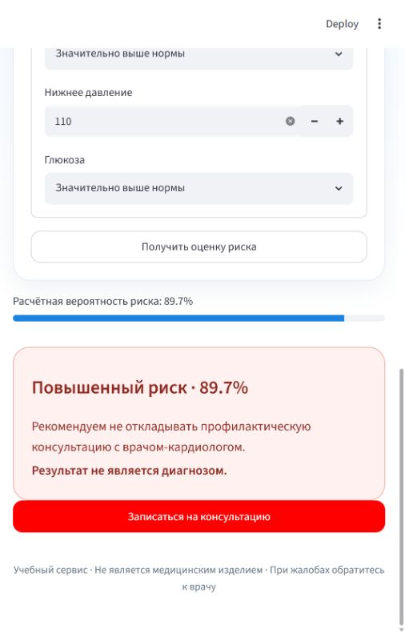

# ML Projects

> Портфолио проектов по машинному обучению на Python. Центральная работа — полноценный сервис для медицинской клиники: от бизнес-гипотезы и исследования данных до обученной модели, API, веб-интерфейса и запуска в контейнерах.


## ❤️ Главный проект — Heart Risk

### Сервис оценки риска сердечно-сосудистых заболеваний

Коммерческая клиника предлагает посетителям рекламной страницы пройти бесплатную экспресс-анкету. Модель оценивает риск сердечно-сосудистых заболеваний, после чего сервис предлагает следующий шаг: профилактические рекомендации или консультацию кардиолога.

Проект закрывает весь путь разработки решения машинного обучения:

- сформулирована бизнес-задача и определена цена ошибок;
- исследованы и очищены 70 000 медицинских анкет;
- созданы дополнительные признаки — возраст в годах и индекс массы тела;
- сравнены логистическая регрессия, дерево решений, случайный лес и CatBoost;
- выполнен подбор параметров CatBoost: 12 комбинаций и 36 обучений;
- отдельно настроен порог под полноту выявления ССЗ не ниже 80%;
- модель обёрнута в API — интерфейс программного взаимодействия на FastAPI;
- создана двухуровневая веб-анкета на Streamlit;
- добавлены контейнеры Docker, воспроизводимые отчёты и визуализации.

| Итоговая метрика | Значение |
|---|---:|
| ROC-AUC | **0,8014** |
| PR-AUC | **0,7849** |
| Полнота выявления ССЗ | **80,57%** |
| Точность положительных прогнозов | **68,03%** |
| F1-мера | **0,7377** |
| Рабочий порог | **0,38** |

<p align="center">
  
  
  
</p>

### [Открыть подробное описание проекта →](projects/heart-disease-risk-service/)

Внутри: бизнес-сценарий, исследование распределений, подготовка данных, сравнение алгоритмов, подбор гиперпараметров, выбор порога, матрица ошибок, архитектура, описание API и инструкции запуска.

> Проект учебный, не является медицинским изделием, не ставит диагноз и не заменяет консультацию врача.

---

## Посмотрите также

Остальные работы вынесены в отдельные репозитории и дополняют главный проект.

| Репозиторий | Что внутри |
|---|---|
| [🧪 Учебные лабораторные по ML](https://github.com/KolyaNG1/ML-labs) | Линейные модели, нейросеть с нуля, свёрточные сети, обучение без учителя, временные ряды и классификация аудио в Jupyter Notebook. |
| [🏠 Предсказание стоимости жилья](https://github.com/KolyaNG1/House-price-prediction) | Задача регрессии: подготовка данных и прогнозирование цены недвижимости. |
| [🚢 Выживаемость пассажиров «Титаника»](https://github.com/KolyaNG1/ML-PET-projects-Titanik) | Учебный проект по бинарной классификации на классическом наборе данных. |

## Навигация по этому репозиторию

```text
ML-Projects/
└── projects/
    └── heart-disease-risk-service/
        ├── data/          # исходные данные
        ├── scripts/       # обучение и построение графиков
        ├── src/           # подготовка признаков и API
        ├── web/           # пользовательская анкета
        ├── reports/       # метрики, графики и скриншоты
        └── README.md      # полный разбор проекта
```
