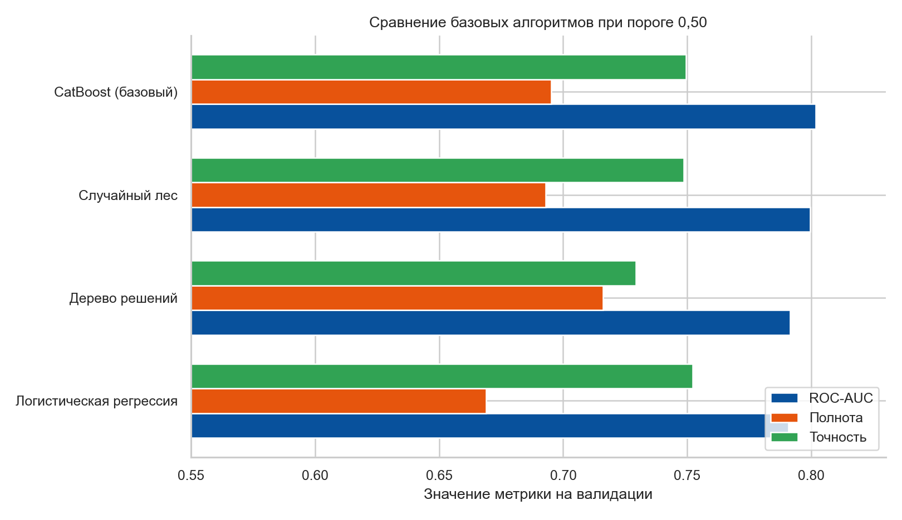
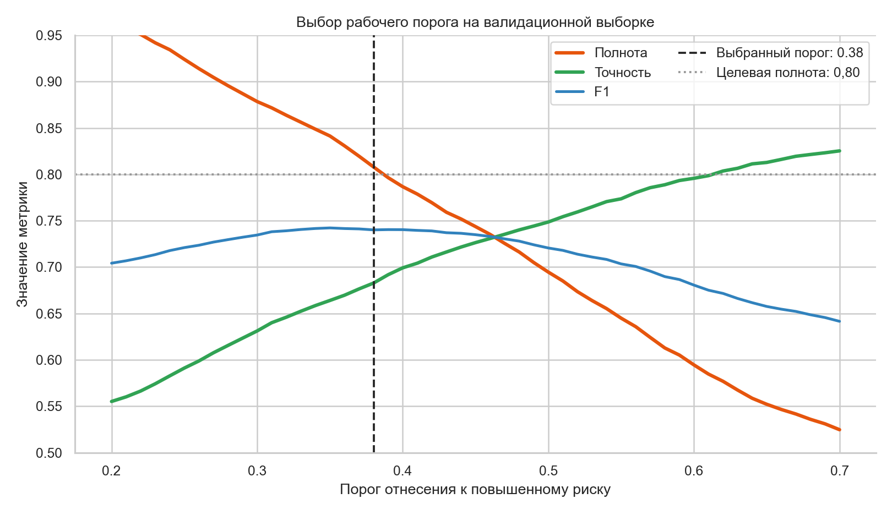
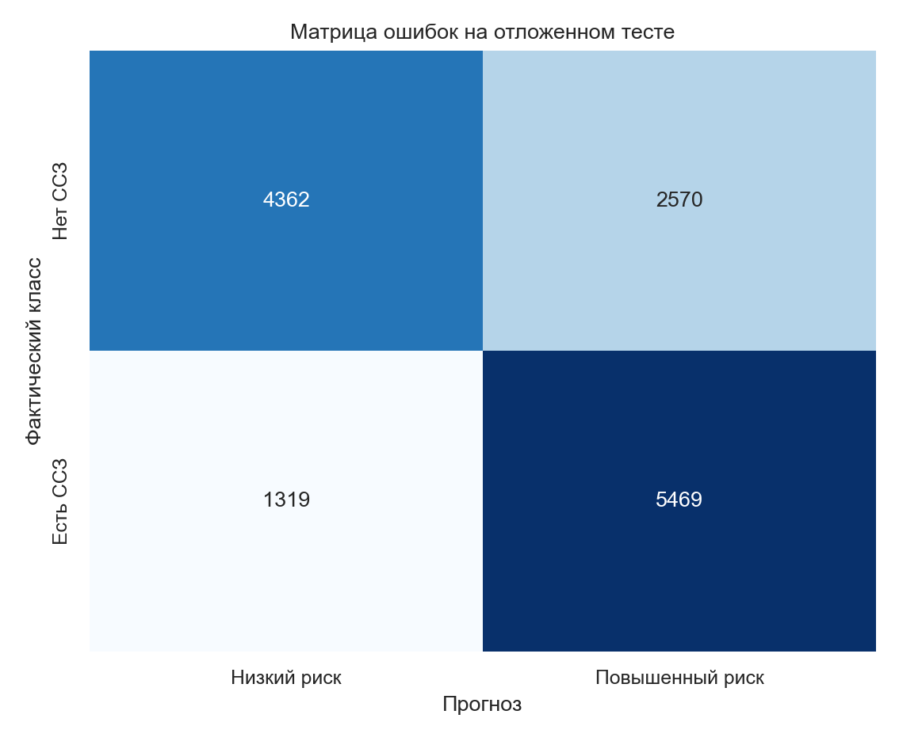

# ❤️ Heart Risk — сервис оценки риска сердечно-сосудистых заболеваний

> Полный учебный ML-проект: от бизнес-гипотезы и исследования 70 000 анкет до подбора модели, настройки рабочего порога, API, веб-интерфейса и запуска в контейнерах.


## Стек

| Область | Технологии | Для чего используются |
|---|---|---|
| Язык и данные | Python 3.11+, pandas, NumPy | загрузка, очистка, преобразование и анализ данных |
| Машинное обучение | scikit-learn, CatBoost | разделение выборки, сравнение алгоритмов, подбор параметров и обучение финальной модели |
| Исследование | Matplotlib, Seaborn | распределения, важность признаков, сравнение моделей и анализ порога |
| Серверная часть | FastAPI, Pydantic, Uvicorn | API — интерфейс программного взаимодействия, проверка входных данных и выдача прогноза |
| Пользовательский интерфейс | Streamlit | адаптивная анкета с базовым и расширенным набором вопросов |
| Сохранение модели | Joblib | хранение обученной модели, порога и метаданных эксперимента |
| Запуск | Docker, Docker Compose | воспроизводимый совместный запуск API и веб-интерфейса |

## Коротко о результате

| Что измерялось | Результат |
|---|---:|
| Исходный набор | 70 000 наблюдений |
| После проверки качества | 68 598 наблюдений |
| ROC-AUC на отложенном тесте | **0,8014** |
| PR-AUC на отложенном тесте | **0,7849** |
| Полнота выявления ССЗ | **80,57%** |
| Точность положительных прогнозов | **68,03%** |
| F1-мера | **0,7377** |
| Рабочий порог | **0,38** |

Финальная модель — CatBoost с параметрами, найденными случайным поиском по 12 комбинациям и трёхчастной перекрёстной проверкой. Порог `0,38` выбран отдельно на валидации: это максимальная точность положительных прогнозов при требовании полноты не ниже 80%.

## Демонстрация

Слева — базовая анкета, в центре — результат для короткой анкеты с низким риском, справа — расширенная анкета и пример повышенного риска.

<p align="center">
  
  
  
</p>

Снимки получены из реально запущенного локального приложения. Для базового примера модель вернула `21,6%`, для расширенного рискованного профиля — `89,7%`.

> Проект не является медицинским изделием. Результат носит информационный характер, не ставит диагноз и не заменяет консультацию врача.

## Содержание

- [Бизнес-задача](#бизнес-задача)
- [Постановка ML-задачи](#постановка-ml-задачи)
- [Данные и признаки](#данные-и-признаки)
- [Проверка и подготовка данных](#проверка-и-подготовка-данных)
- [Исследовательский анализ](#исследовательский-анализ)
- [Схема эксперимента](#схема-эксперимента)
- [Сравнение алгоритмов](#сравнение-алгоритмов)
- [Подбор гиперпараметров](#подбор-гиперпараметров)
- [Выбор порога](#выбор-порога)
- [Финальное качество](#финальное-качество)
- [Устройство сервиса](#устройство-сервиса)
- [API](#api)
- [Запуск](#запуск)
- [Структура проекта](#структура-проекта)
- [Ограничения и развитие](#ограничения-и-развитие)

## Бизнес-задача

Коммерческая клиника запускает рекламную кампанию о профилактике сердечно-сосудистых заболеваний. Вместо обычного перехода на посадочную страницу пользователь получает конкретную пользу: бесплатно и без регистрации проходит короткое анкетирование и сразу видит информационную оценку риска.

Предполагаемая воронка:

```text
Реклама о профилактике ССЗ
            ↓
Бесплатная экспресс-анкета
            ↓
Персонализированная оценка риска
       ↙                         ↘
Повышенный риск                Низкий риск
Запись к кардиологу      Профилактика / обследование
```

Ценность для клиники:

- повысить кликабельность рекламы за счёт полезного интерактивного предложения;
- превратить обезличенный рекламный переход в осмысленное обращение;
- предложить подходящий следующий шаг в зависимости от результата анкеты;
- увеличить число записей на консультации и профилактические обследования.

Цена ошибки несимметрична. Ложно положительный результат приводит к дополнительной консультации, а ложно отрицательный может создать ложное чувство безопасности. Поэтому проект оптимизируется прежде всего на **полноту** — долю фактических случаев ССЗ, найденных моделью.

## Постановка ML-задачи

Это задача бинарной классификации. По анкетным данным модель вычисляет вероятность класса `cardio = 1`, после чего бизнес-порог переводит её в один из двух уровней:

- `high` — повышенный риск, предлагается консультация врача;
- `low` — низкий риск, предлагаются профилактика и регулярные обследования.

Здесь важно разделять две задачи:

1. **Модель должна хорошо ранжировать людей по риску.** Для выбора алгоритма используется ROC-AUC — площадь под кривой соотношения верно и ложно положительных срабатываний.
2. **Сервис должен осторожно выбирать решение.** Для рабочего порога задано требование полноты не ниже 80%, после чего среди допустимых порогов максимизируется точность положительных прогнозов.

Так порог не «подгоняется» под тест: модель, её параметры и порог выбираются до финальной оценки.

## Данные и признаки

Используется [Cardiovascular Disease dataset](https://www.kaggle.com/datasets/sulianova/cardiovascular-disease-dataset) с 70 000 обезличенными наблюдениями. Исходный файл сохранён в `data/raw/cardio_train.csv`, поэтому эксперимент воспроизводится без ручной подготовки данных.

### Основная анкета

| Поле | Значение | Тип |
|---|---|---|
| `age` | возраст в днях | числовой |
| `gender` | `1` — женщина, `2` — мужчина | категориальный |
| `height` | рост, см | числовой |
| `weight` | вес, кг | числовой |
| `smoke` | курение | бинарный |
| `alco` | употребление алкоголя | бинарный |
| `active` | физическая активность | бинарный |

### Расширенная анкета

| Поле | Значение | Тип |
|---|---|---|
| `ap_hi` | верхнее артериальное давление | числовой |
| `ap_lo` | нижнее артериальное давление | числовой |
| `cholesterol` | `1` — норма, `2` — выше нормы, `3` — значительно выше | порядковый |
| `gluc` | уровень глюкозы в той же трёхуровневой шкале | порядковый |

### Созданные признаки

- `bmi` — индекс массы тела: вес / рост²;
- `age_years` — возраст в годах вместо менее интерпретируемого количества дней.

Подготовка вынесена в одну функцию `make_features()`. Её используют и обучение, и API: это защищает сервис от расхождения между признаками во время эксперимента и после запуска.

## Проверка и подготовка данных

В исходном наборе встречаются физиологически неправдоподобные измерения. До разбиения выборки применяются явные правила:

- рост от 120 до 220 см;
- вес от 35 до 200 кг;
- верхнее давление от 80 до 250 мм рт. ст.;
- нижнее давление от 40 до 180 мм рт. ст.;
- верхнее давление обязательно выше нижнего;
- удаляются полные дубликаты строк.

Удалено 1 402 строки, осталось 68 598 наблюдений. Исходный файл при этом не изменяется: очистка выполняется воспроизводимо внутри обучающего сценария.

Для короткой анкеты неизвестные медицинские показатели временно заполняются нейтральными значениями: `120/80`, холестерин и глюкоза — «в норме». Это позволяет показать работу прототипа, но отмечено как продуктовое ограничение: для эксплуатации нужна отдельная модель короткой анкеты и сравнение её качества с полной версией.

## Исследовательский анализ

### Баланс классов

Целевой признак почти идеально сбалансирован: 35 021 наблюдение без ССЗ и 34 979 с ССЗ. Поэтому обычная доля правильных ответов не будет искусственно высокой из-за преобладания одного класса, но для бизнес-задачи всё равно важнее полнота.


### Распределения ключевых признаков

Группа с ССЗ в среднем старше и чаще имеет повышенное верхнее давление. Распределение индекса массы тела также сдвинуто вправо. Связи перекрываются: одного признака недостаточно, поэтому модели нужны совместные нелинейные зависимости.


### Важность признаков

Наибольший вклад в CatBoost дают артериальное давление, возраст и метаболические показатели. Важность показывает полезность признака для предсказания, но не доказывает медицинскую причинность.


## Схема эксперимента

После очистки данные один раз делятся стратифицированно и с фиксированным случайным состоянием `42`:

| Часть | Наблюдений | Назначение |
|---|---:|---|
| Обучающая | 41 158 (60%) | обучение базовых моделей и поиск параметров |
| Валидационная | 13 720 (20%) | сравнение подходов и выбор рабочего порога |
| Тестовая | 13 720 (20%) | единственная финальная оценка |

```text
Очистка → создание признаков → train / validation / test
                                   ↓
                         сравнение 4 алгоритмов
                                   ↓
                   подбор CatBoost: 12 × 3 обучения
                                   ↓
                 выбор порога только на validation
                                   ↓
                переобучение на train + validation
                                   ↓
                       однократная оценка на test
```

Такое разделение снижает риск утечки: тестовая часть не участвует ни в выборе модели, ни в настройке параметров, ни в выборе порога.

## Сравнение алгоритмов

Сначала сравнивались четыре подхода при стандартном пороге `0,50`. Логистическая регрессия служит интерпретируемой линейной отправной точкой, дерево — простой нелинейной, случайный лес — ансамблевым ориентиром, CatBoost — основным кандидатом для табличных данных.

| Модель | ROC-AUC | Полнота | Точность положительных прогнозов | F1 |
|---|---:|---:|---:|---:|
| **CatBoost, базовый** | **0,8017** | 0,6952 | 0,7495 | 0,7213 |
| Случайный лес | 0,7995 | 0,6930 | 0,7487 | 0,7198 |
| Дерево решений | 0,7914 | **0,7160** | 0,7294 | **0,7226** |
| Логистическая регрессия | 0,7907 | 0,6688 | **0,7523** | 0,7081 |



CatBoost выбран не из-за большого отрыва, а из-за лучшего качества ранжирования, устойчивой работы с нелинейностями и возможности явно обрабатывать категориальные поля. Случайный лес остаётся сильной более быстрой альтернативой.

## Подбор гиперпараметров

Гиперпараметры — настройки алгоритма, которые не обучаются автоматически из данных. Для CatBoost использован случайный поиск: из пространства вариантов воспроизводимо выбираются 12 комбинаций, каждая оценивается трёхчастной стратифицированной перекрёстной проверкой. Всего выполняется **36 обучений**.

### Пространство поиска

| Параметр | Проверяемые значения | Влияние |
|---|---|---|
| `iterations` | 300, 500, 700 | количество деревьев; больше — гибче модель, но дольше обучение и выше риск переобучения |
| `depth` | 4, 5, 6, 7 | глубина дерева и сложность взаимодействий между признаками |
| `learning_rate` | 0,03; 0,05; 0,08; 0,10 | величина вклада каждого нового дерева |
| `l2_leaf_reg` | 3, 5, 7, 9 | L2-регуляризация, штрафующая слишком сложные решения |
| `random_strength` | 0,5; 1,0; 2,0 | случайность при выборе разбиений дерева |
| `bagging_temperature` | 0; 0,5; 1,0 | интенсивность случайного выбора объектов для деревьев |

Основной показатель поиска — средний ROC-AUC. Полнота и точность положительных прогнозов сохраняются для анализа, но рабочий компромисс между ними определяется позже отдельным порогом.

### Лучшая конфигурация

```python
CatBoostClassifier(
    iterations=300,
    depth=7,
    learning_rate=0.03,
    l2_leaf_reg=9,
    random_strength=0.5,
    bagging_temperature=0.5,
    loss_function="Logloss",
    eval_metric="AUC",
    random_seed=42,
)
```

Средний ROC-AUC лучшей конфигурации на перекрёстной проверке — **0,8014**. Небольшая скорость обучения `0,03` в сочетании с 300 деревьями даёт плавное улучшение, глубина 7 позволяет учитывать взаимодействия, а усиленная регуляризация `9` ограничивает переобучение.

Полная таблица всех комбинаций сохраняется в [`reports/hyperparameter-search.csv`](reports/hyperparameter-search.csv).

## Выбор порога

Вероятность сама по себе ещё не определяет действие сервиса. Стандартный порог `0,50` даёт более высокую точность положительных прогнозов, но пропускает слишком много людей с ССЗ. Поэтому на валидационной части проверяются пороги от `0,20` до `0,70` с шагом `0,01`.

Правило выбора:

1. оставить пороги с полнотой не ниже `0,80`;
2. среди них выбрать порог с максимальной точностью положительных прогнозов;
3. зафиксировать порог до просмотра тестовой выборки.

Выбран порог **0,38**.



Снижение порога увеличивает количество направлений к врачу и число ложных тревог, но уменьшает вероятность пропустить человека с повышенным риском. Это соответствует исходной бизнес-логике и медицинской осторожности. В реальном продукте целевую полноту должна утверждать клиника совместно с врачами и экономистами.

## Финальное качество

После выбора параметров и порога CatBoost заново обучается на объединённых обучающей и валидационной частях. Тестовые 13 720 наблюдений используются один раз.

| Метрика | Значение | Что означает |
|---|---:|---|
| ROC-AUC | **0,8014** | качество ранжирования риска независимо от порога |
| PR-AUC | **0,7849** | площадь под кривой точность–полнота |
| Полнота | **0,8057** | найдено 80,57% фактических случаев ССЗ |
| Точность положительных прогнозов | **0,6803** | 68,03% повышенных рисков соответствуют классу ССЗ |
| F1-мера | **0,7377** | гармонический баланс полноты и точности |
| Доля правильных ответов | **0,7165** | верно классифицировано 71,65% тестовых наблюдений |
| Brier score | **0,1806** | среднеквадратичная ошибка вероятностного прогноза; меньше — лучше |



Из 6 788 тестовых случаев ССЗ модель нашла 5 469 и пропустила 1 319. Одновременно получено 2 570 ложных срабатываний. Для медицинского привлечения это осознанный компромисс, но не клинически подтверждённая рабочая точка.

## Устройство сервиса


Что исправлено и усилено по сравнению с первоначальным прототипом:

- вероятность берётся для класса `1` — «есть ССЗ»;
- код пола приведён к исходной схеме датасета: `1/2`;
- один и тот же код создаёт признаки при обучении и прогнозе;
- категориальные поля сохраняют целочисленный тип даже при короткой анкете;
- модель загружается один раз, а не на каждый запрос;
- порог хранится вместе с моделью и не расходится с экспериментом;
- Pydantic проверяет диапазоны и требует, чтобы верхнее давление было выше нижнего;
- интерфейс показывает дисклеймер и корректно обрабатывает недоступность API.

## API

### Проверка состояния

```http
GET /health
```

### Расчёт риска

```http
POST /score
Content-Type: application/json
```

Пример тела запроса:

```json
{
  "age": 23741,
  "gender": 2,
  "height": 170,
  "weight": 110,
  "smoke": 1,
  "alco": 1,
  "active": 0,
  "ap_hi": 180,
  "ap_lo": 110,
  "cholesterol": 3,
  "gluc": 3
}
```

Пример ответа:

```json
{
  "risk_probability": 0.8974,
  "risk_level": "high",
  "threshold": 0.38,
  "medical_disclaimer": "Результат носит информационный характер и не является диагнозом."
}
```

Интерактивная документация после запуска доступна по адресу `http://127.0.0.1:8000/docs`.

## Запуск

### Локально

Нужен Python 3.11 или новее.

```bash
cd projects/heart-disease-risk-service
python -m venv .venv

# Windows PowerShell
.venv\Scripts\Activate.ps1

pip install -r requirements.txt
pip install -e .
```

В двух терминалах:

```bash
uvicorn heart_risk.api:app --reload
```

```bash
streamlit run web/app.py
```

- анкета: `http://localhost:8501`;
- документация API: `http://localhost:8000/docs`.

### В контейнерах

```bash
docker compose up --build
```

Docker Compose поднимает два сервиса: `api` и `web`. Интерфейс обращается к API по внутреннему имени контейнера.

### Полное воспроизведение эксперимента

```bash
python scripts/train.py
python scripts/create_eda_figures.py
```

`train.py` заново сравнит модели, выполнит 36 обучений при подборе параметров, выберет порог и перезапишет модель и таблицы отчёта. Это заметно дольше обычного применения уже обученной модели.

## Структура проекта

```text
heart-disease-risk-service/
├── artifacts/
│   └── heart_risk_catboost.joblib     # модель, порог и метаданные
├── data/raw/
│   └── cardio_train.csv               # исходный набор данных
├── reports/
│   ├── figures/                       # 6 графиков исследования
│   ├── screenshots/                   # снимки работающего интерфейса
│   ├── model-comparison.csv           # сравнение алгоритмов
│   ├── hyperparameter-search.csv      # все комбинации поиска
│   ├── threshold-search.csv           # метрики для каждого порога
│   └── metrics.json                   # итог эксперимента
├── scripts/
│   ├── train.py                       # полный обучающий сценарий
│   └── create_eda_figures.py          # воспроизводимые графики
├── src/heart_risk/
│   ├── api.py                         # FastAPI-приложение
│   ├── features.py                    # очистка и признаки
│   └── schemas.py                     # схема и проверка анкеты
├── web/app.py                         # Streamlit-интерфейс
├── Dockerfile
├── docker-compose.yml
├── pyproject.toml
└── requirements.txt
```

## Ограничения и развитие

### Текущие ограничения

1. **Нет клинической валидации.** Метрики относятся только к публичному набору и не гарантируют качество на пациентах конкретной клиники.
2. **Короткая анкета упрощена.** Нейтральное заполнение неизвестных полей может занижать риск; нужна отдельная модель на базовых признаках.
3. **Вероятности не откалиброваны отдельно.** Brier score измерен, но для отображения процентов пациентам нужна дополнительная калибровка и проверка калибровочной кривой.
4. **Нет анализа справедливости.** Нужно сравнить качество по полу, возрастным группам и другим клинически значимым подгруппам.
5. **Публичный датасет ограничен.** Возможны смещения сбора, ошибки измерений и отличие от целевой аудитории клиники.

### План развития

- обучить отдельную модель короткой анкеты и автоматически выбирать модель по доступным полям;
- добавить калибровку вероятностей и доверительные интервалы метрик;
- провести анализ качества по подгруппам и исследование устойчивости к пропускам;
- добавить автоматические тесты признаков, API и интерфейса;
- журналировать технические события без хранения медицинских данных;
- настроить мониторинг распределений и деградации качества;
- проводить переобучение только по согласованному с врачами процессу.

## Воспроизводимость

Все заявленные числа создаются кодом:

- фиксированное случайное состояние `42`;
- стратифицированные разбиения;
- тестовая выборка изолирована до финальной оценки;
- параметры поиска, результаты каждого порога и метрики сохранены в `reports/`;
- модель поставляется вместе с выбранным порогом;
- графики строятся из тех же файлов, которые использует README.

## Данные

Данные принадлежат авторам исходного [Cardiovascular Disease dataset](https://www.kaggle.com/datasets/sulianova/cardiovascular-disease-dataset) и используются здесь в учебных целях. Перед повторным использованием необходимо проверить условия источника.
