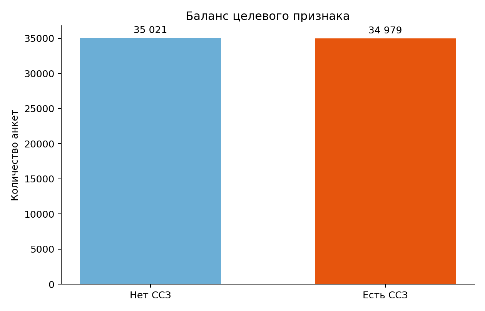
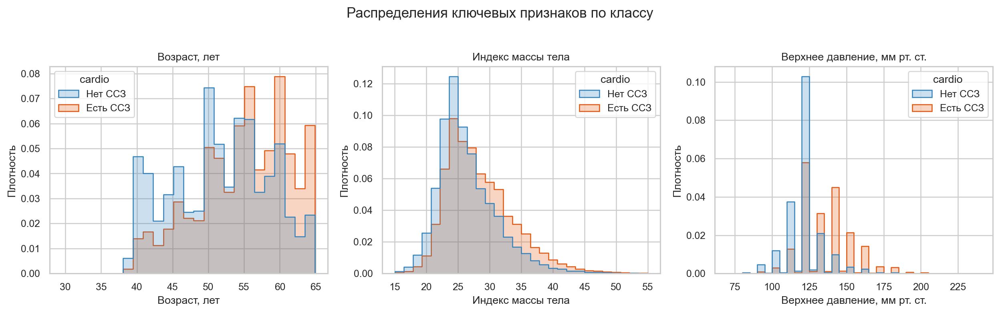
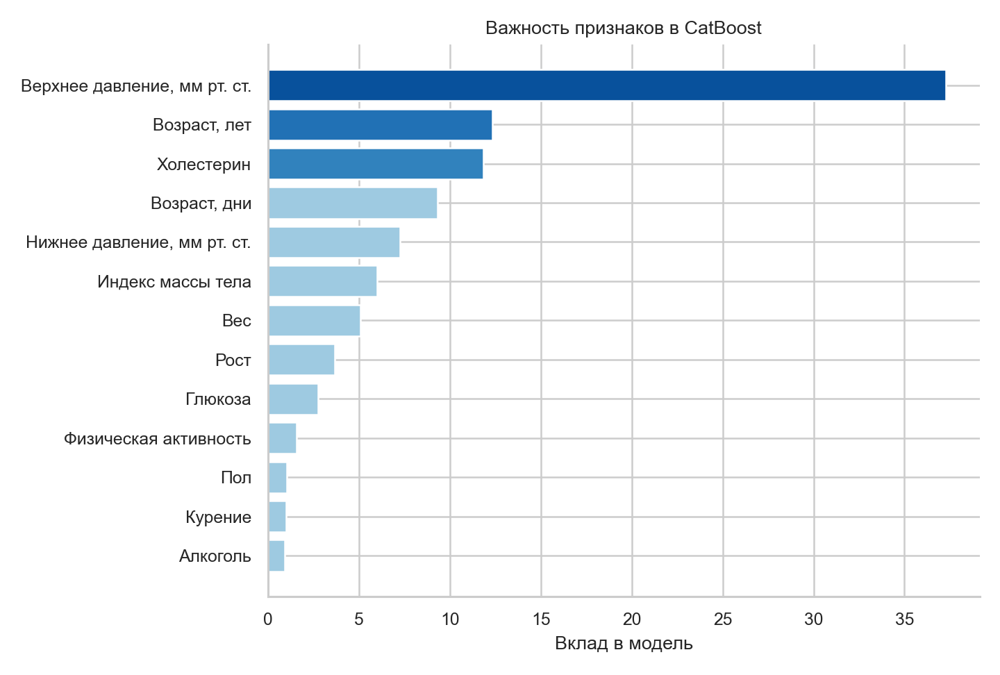
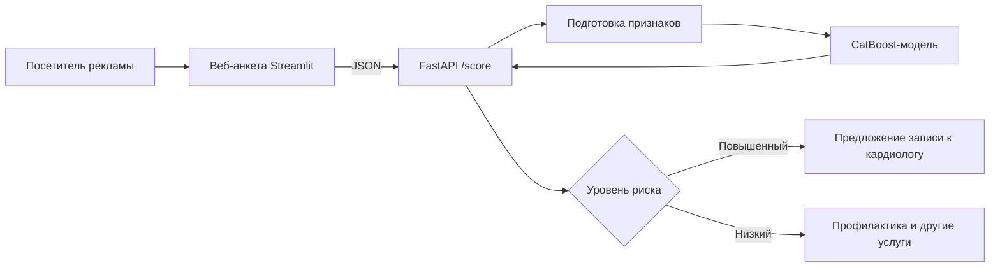

# ❤️ Сервис оценки риска сердечно-сосудистых заболеваний

> Учебный проект: CatBoost-модель, API и веб-анкета для быстрой **информационной** оценки риска ССЗ.


## Содержание

- [Идея и бизнес-сценарий](#идея-и-бизнес-сценарий)
- [Что сделано](#что-сделано)
- [Данные и анкета](#данные-и-анкета)
- [Исследование данных](#исследование-данных)
- [Алгоритм и оценка качества](#алгоритм-и-оценка-качества)
- [Устройство сервиса](#устройство-сервиса)
- [Запуск](#запуск)
- [Пример запроса](#пример-запроса)
- [Ограничения и следующие шаги](#ограничения-и-следующие-шаги)

## Идея и бизнес-сценарий

Коммерческая клиника проводит рекламную кампанию о профилактике сердечно-сосудистых заболеваний. Вместо обычного рекламного объявления посетителю предлагают бесплатно и быстро пройти короткое анкетирование. Это создаёт полезный повод перейти на сайт, а значит помогает увеличивать кликабельность рекламы и число осмысленных обращений в клинику.

После анкеты сервис оценивает вероятность риска ССЗ:

- при повышенном риске предлагает записаться на консультацию к кардиологу;
- при промежуточном или низком риске мотивирует заботиться о здоровье и может предложить профилактический осмотр или другие релевантные услуги.

В медицинском сценарии особенно опасно не заметить человека с высоким риском. Поэтому основная метрика — **полнота (recall)**: доля случаев ССЗ, которые модель сумела обнаружить. Порог решения выбран ниже стандартных 0,5, чтобы осторожнее относиться к пропуску потенциально рискованных случаев; при этом контролируются точность положительных прогнозов и площадь под ROC-кривой.

> Важно: проект учебный. Его результат не ставит диагноз, не заменяет врача и не должен применяться для клинических решений без валидации на целевой популяции, юридической оценки и медицинской экспертизы.

## Что сделано

- Модель бинарной классификации на CatBoost для оценки вероятности наличия ССЗ.
- Два уровня анкеты: базовый — доступный большинству пользователей; расширенный — с давлением, холестерином и глюкозой.
- Единое преобразование признаков для обучения и применения, чтобы исключить расхождение расчётов.
- FastAPI-сервис с проверкой диапазонов полей и понятным JSON-ответом.
- Streamlit-интерфейс с минималистичной формой и развертываемым блоком «Подробнее».
- Воспроизводимые скрипты обучения и построения графиков для отчёта.
- Контейнеризация API и интерфейса через Docker Compose.

## Данные и анкета

Используется [Cardiovascular Disease dataset](https://www.kaggle.com/datasets/sulianova/cardiovascular-disease-dataset): 70 000 обезличенных наблюдений. Целевой столбец `cardio` показывает наличие ССЗ: `1` — есть, `0` — нет. Копия файла находится в `data/raw/cardio_train.csv` для воспроизводимости учебного проекта.

| Группа | Поля | Что вводит пользователь |
|---|---|---|
| Основная анкета | `age`, `gender`, `height`, `weight`, `smoke`, `alco`, `active` | возраст, пол, рост, вес, курение, алкоголь, физическая активность |
| Расширенная анкета | `ap_hi`, `ap_lo`, `cholesterol`, `gluc` | верхнее и нижнее давление, холестерин, глюкоза |
| Производные признаки | `bmi`, `age_years` | индекс массы тела и возраст в годах, рассчитываются автоматически |

Если посетитель не знает результаты измерений и не раскрывает раздел «Подробнее», сервис применяет нейтральные значения: давление 120/80, холестерин и глюкоза — «в норме». Это позволяет показать сценарий короткой анкеты, но является упрощением: для реального запуска корректнее обучить отдельную модель только на базовых полях и явно сообщать о меньшей точности результата.

## Исследование данных

### Баланс классов

Набор почти сбалансирован: это снижает риск, что модель будет получать высокую формальную точность за счёт постоянного предсказания наиболее частого класса.



### Распределения важных признаков

На графике рискованная группа в среднем старше, имеет более высокое верхнее давление и несколько иной профиль индекса массы тела. Для удобства чтения при построении визуализации отсечены только экстремальные физиологически сомнительные значения; обучение использует исходный набор как он есть.



### Важность признаков

CatBoost оценивает вклад признаков по тому, насколько они помогают разделять классы в деревьях. В этой версии наибольшую роль играют давление, возраст и показатели обмена веществ. Важность не доказывает причинную связь и не заменяет медицинскую интерпретацию.



## Алгоритм и оценка качества

### Почему CatBoost

Выбран CatBoost — ансамбль решающих деревьев с последовательным улучшением ошибок. Он хорошо подходит для табличных данных: учитывает нелинейные связи, не требует масштабирования числовых полей и уверенно работает с категориальными кодами. Параметры текущего эксперимента: 500 деревьев глубины 5, скорость обучения 0,05 и фиксированное случайное состояние `42`.

### Пайплайн обучения

```text
CSV с анкетами
      ↓
Удаление id → заполнение пустых расширенных полей → bmi + возраст в годах
      ↓
Стратифицированное разделение: 80% обучение / 20% тест
      ↓
CatBoostClassifier → вероятность риска P(ССЗ)
      ↓
Порог 0,45 → «повышенный» / «низкий» риск
```

Стратифицированное разделение сохраняет близкую долю классов и в обучающей, и в тестовой частях. Вероятность берётся строго из второго столбца `predict_proba(...)[0, 1]`, то есть именно для класса «есть ССЗ».

### Результат на отложенной выборке

Эксперимент воспроизводится командой `python scripts/train.py`. Числа ниже получены на фиксированном тестовом наборе из 14 000 записей при пороге 0,45.

| Показатель | Значение | Интерпретация |
|---|---:|---|
| Набор данных | 70 000 анкет | исходная выборка |
| ROC-AUC | 0,8006 | насколько хорошо модель ранжирует риск выше случайного выбора |
| Полнота (recall) | 0,7417 | модель находит 74,17% пациентов с ССЗ |
| Точность положительного прогноза (precision) | 0,7256 | около 72,56% срабатываний повышенного риска подтверждаются классом ССЗ в наборе |
| Порог риска | 0,45 | компромисс в пользу поиска большего числа рискованных случаев |

Это не клиническая валидация. Метрики отражают только качество на выбранном публичном наборе и не гарантируют результат для пациентов конкретной клиники.

## Устройство сервиса



```text
heart-disease-risk-service/
├── artifacts/                 # сохранённая обученная модель
├── data/raw/                  # исходный набор данных
├── Dockerfile                  # единый образ приложения
├── docker-compose.yml          # совместный запуск API и интерфейса
├── reports/figures/           # графики для исследования
├── scripts/
│   ├── train.py               # обучение, оценка и сохранение модели
│   └── create_eda_figures.py  # построение графиков
├── src/heart_risk/
│   ├── api.py                 # HTTP API
│   ├── features.py            # единая подготовка признаков
│   └── schemas.py             # проверка входной анкеты
├── web/app.py                 # пользовательская анкета
├── requirements.txt
└── README.md
```

## Запуск

Нужен Python 3.11 или новее.

```bash
cd projects/heart-disease-risk-service
python -m venv .venv
# Windows PowerShell
.venv\Scripts\Activate.ps1
pip install -r requirements.txt
pip install -e .
```

При желании переобучить модель и пересобрать иллюстрации:

```bash
python scripts/train.py
python scripts/create_eda_figures.py
```

Запустите API в одном окне терминала и интерфейс — в другом:

```bash
uvicorn heart_risk.api:app --reload
streamlit run web/app.py
```

- документация API: `http://127.0.0.1:8000/docs`;
- интерфейс анкеты: `http://localhost:8501`.

### Запуск в контейнерах

Если установлен Docker Desktop, весь сервис можно поднять одной командой:

```bash
docker compose up --build
```

После сборки интерфейс доступен по адресу `http://localhost:8501`, а документация API — по адресу `http://localhost:8000/docs`.

## Пример запроса

```bash
curl -X POST http://127.0.0.1:8000/score \
  -H "Content-Type: application/json" \
  -d '{
    "age": 16436,
    "gender": 1,
    "height": 168,
    "weight": 62,
    "smoke": 0,
    "alco": 0,
    "active": 1,
    "ap_hi": 110,
    "ap_lo": 80,
    "cholesterol": 1,
    "gluc": 1
  }'
```

Ответ имеет вид:

```json
{
  "risk_probability": 0.1842,
  "risk_level": "low",
  "threshold": 0.45,
  "medical_disclaimer": "Результат носит информационный характер и не является диагнозом."
}
```

## Ограничения и следующие шаги

1. **Безопасность и медицина.** Нужны клиническая валидация, согласование с врачами, анализ смещений по группам, защита персональных данных и юридическая оценка до любого реального использования.
2. **Короткая анкета.** Вместо заполнения неизвестных медицинских полей нейтральными значениями обучить и сравнить отдельную модель для базовой анкеты.
3. **Подготовка данных.** Добавить правила очистки аномальных значений давления, роста и веса, документировать их до обучения.
4. **Выбор порога.** Настраивать порог на валидационной выборке вместе с клиникой с учётом стоимости пропуска случая и ложного направления.
5. **Эксплуатация.** Добавить автоматические тесты, журналирование без персональных данных, мониторинг качества и переобучение по согласованному процессу.

## Источник и лицензия данных

Данные принадлежат авторам исходного [набора на Kaggle](https://www.kaggle.com/datasets/sulianova/cardiovascular-disease-dataset). Они используются здесь только в учебных целях. Перед повторным использованием ознакомьтесь с условиями источника.
